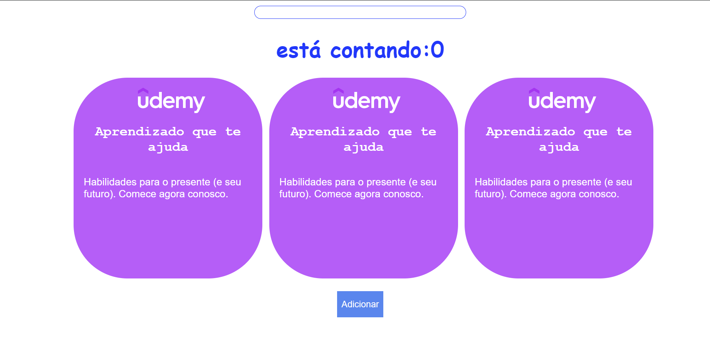

<div align="center" id="top"> 
  

  &#xa0;

</div>

<h1 align="center">ReactJS - Aprendendo Rápido</h1>

<p align="center">
  

  

  

  

  <!--  -->

  <!--  -->

  <!--  -->
</p>

<!-- Status -->

<!-- <h4 align="center"> 
	🚧  ReactJS_learningFast 🚀 Em construção...  🚧
</h4> 

<hr> -->

<p align="center">
  <a href="#dart-sobre">Sobre</a> &#xa0; | &#xa0; 
  <a href="#sparkles-funcionalidades">Funcionalidades</a> &#xa0; | &#xa0;
  <a href="#rocket-tecnologias">Tecnologias</a> &#xa0; | &#xa0;
  <a href="#white_check_mark-pré-requesitos">Pré requisitos</a> &#xa0; | &#xa0;
  <a href="#checkered_flag-começando">Começando</a> &#xa0; | &#xa0;
  <a href="#memo-licença">Licença</a> &#xa0; | &#xa0;
  <a href="https://github.com/Gabriel4420" target="_blank">Autor</a>
</p>

<br>

## :dart: Sobre ##

Projeto feito no curso de ReactJS Aprendendo Rápido, ministrado pelo professor Henrique Weiand, aonde o mesmo ensina : 

A configurar um ambiente do zero assim como conceitos e features básicas do ecossistema React para se tornar de fato um dev ReactJS. 

Além de conhecer rapidamente cada ferramenta, seja ela para ganho de produtividade ou de ambiente assim como os principais conceitos que giram em torno da lib.

## :sparkles: Funcionalidades ##

:heavy_check_mark: Contador ;\
:heavy_check_mark: Mudanças de estado com input;\

## :rocket: Tecnologias ##

As seguintes ferramentas foram usadas na construção do projeto:


- [Node.js](https://nodejs.org/en/)
- [React](https://pt-br.reactjs.org/)

## :white_check_mark: Pré requisitos ##

Antes de começar :checkered_flag:, você precisa ter o [Git](https://git-scm.com) e o [Node](https://nodejs.org/en/) instalados em sua maquina.

## :checkered_flag: Começando ##

```bash
# Clone este repositório
$ git clone https://github.com/Gabriel4420/ReactJS_learningFast

# Instale as dependências
$ yarn

# Para iniciar o projeto
$ yarn start

# O app vai inicializar em <http://localhost:8080>
```

Feito com :heart: por <a href="https://github.com/Gabriel4420" target="_blank">Gabriel Rodrigues Perez</a>

&#xa0;

<a href="#top">Voltar para o topo</a>
